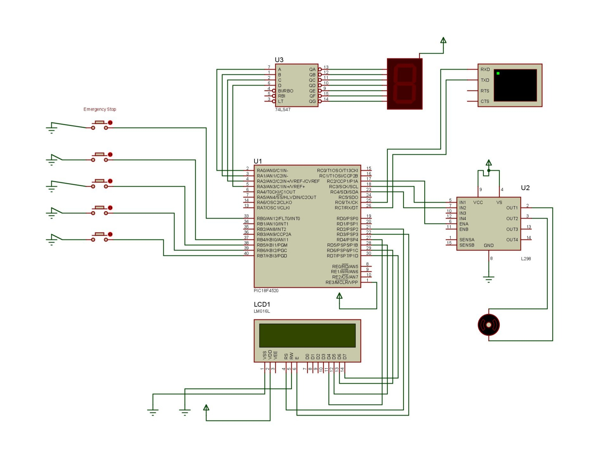
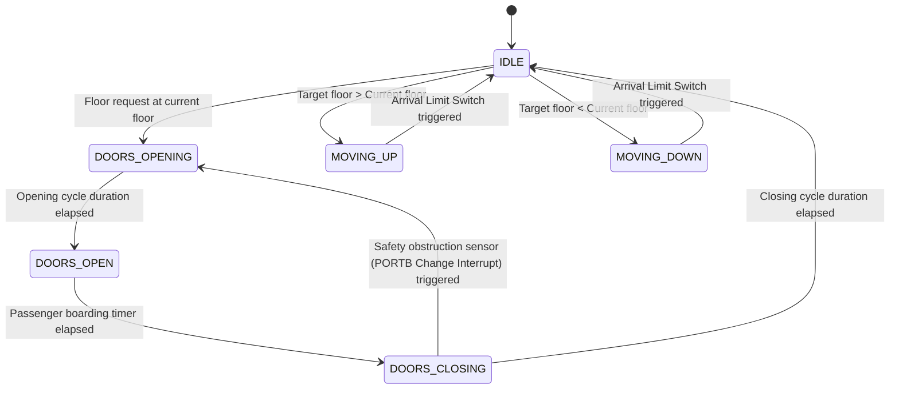

# Embedded Elevator Control and Monitoring System

A multi-floor intelligent elevator control and monitoring system using the PIC18F4520 microcontroller, simulated within the Proteus Design Suite. This repository contains the complete circuit design, system firmware binary, and documentation detailing the real-time scheduler, finite state machine architecture, speed control algorithms, and safety interrupts.

---

## Interactive Simulation Dashboard

Below is a live, self-contained interactive SVG dashboard illustrating the physical movement, door cycles, 7-segment display logic, and UART serial communication logs of the system:



---

## Schematic Design

The circuit schematic represents the hardware configuration of the system, illustrating the connections between the PIC18F4520, the L293D motor driver, visual status indicators (LCD and 7-segment), user request interfaces, and the UART monitoring connection.



---

## Interactive Technical Specifications

Click on any section header below to expand the complete engineering details of the system.

<details>
<summary><b>1. Microcontroller Configuration & Registers</b></summary>
<p>

The system runs on a PIC18F4520 configured with an external oscillator (typically 8 MHz or 20 MHz). The following key hardware registers are configured at startup:

*   **Oscillator & Ports Control**:
    *   `ADCON1 = 0x0F`: Configures all analog channels as digital I/O pins to prevent interference on Port A and Port B.
    *   `TRISB = 0xF1`: Sets RB0 and RB4–RB7 as inputs to monitor the emergency stop and floor requests/safety sensor.
    *   `TRISA = 0x00`: Sets Port A pins (RA0-RA3) as outputs to drive the 74LS47 decoder.
    *   `TRISD = 0x00` / `TRISC = 0x80`: Sets Port D as outputs for the display modules (LCD data RD4-RD7, LCD control RD2-RD3), and configures Port C with RC7/RX as input, and RC2-RC4, RC6 as outputs.
*   **PWM Generation (CCP1 Module)**:
    *   `PR2`: Preset register configured to establish the PWM carrier frequency (typically ~2 kHz to 5 kHz for DC motor control).
    *   `T2CON = 0x05`: Configures Timer 2 with a prescaler of 4 and turns the timer on.
    *   `CCP1CON = 0x0C`: Configures the CCP1 module in Pulse Width Modulation mode on RC2.
    *   `CCPR1L`: Modulated runtime duty cycle register (controls motor speed).
*   **Interrupt Configuration**:
    *   `INTCON = 0xD8`: Enables global interrupts (GIE), peripheral interrupts (PEIE), RB0/INT0 external interrupt (INT0IE), and PORTB change interrupts (RBIE).
    *   `INTCON2 = 0x00`: Configures Port B pull-ups and sets external interrupts on falling edge triggers.
    *   `PIE1 = 0x30`: Enables Timer1 (scheduling ticks) and UART receive interrupts.
*   **UART Telemetry**:
    *   `TXSTA = 0x24`: High-speed asynchronous transmit enabled.
    *   `RCSTA = 0x90`: Serial port enabled, continuous receive enabled.
    *   `SPBRG = 51`: Configured for a 9600 Baud rate under an 8 MHz instruction clock.

</p>
</details>

<details>
<summary><b>2. System Pin Mapping Table</b></summary>
<p>

The physical mapping of the PIC18F4520 microcontroller inputs and outputs is defined as follows:

| MCU Pin | Symbol / Connection | Direction | Description |
| :--- | :--- | :--- | :--- |
| **RB0** | `INT0` / Emergency Stop | Input (Interrupt) | Cabin emergency stop button (triggers high-priority interrupt) |
| **RB4–RB7** | Floor Requests / Safety Sensor | Input (Interrupt) | PORTB Change Interrupt inputs (Floor requests and safety sensor) |
| **RA0–RA3** | 7-Segment BCD | Output | BCD data output (A-D) driving the 74LS47 segment decoder |
| **RD4–RD7** | LCD Data | Output | 4-bit data bus lines for the text telemetry LCD |
| **RD2** | LCD RS | Output | LCD Register Select signal |
| **RD3** | LCD EN | Output | LCD Enable signal |
| **RC2** | `CCP1` / Motor PWM | Output | Motor speed control via PWM (drives L298 IN1/IN3) |
| **RC3** | Motor Dir A | Output | H-Bridge Direction Control A (drives L298 IN2) |
| **RC4** | Motor Dir B | Output | H-Bridge Direction Control B (drives L298 IN4) |
| **RC6** | `TX` / UART TX | Output | Transmits status to Virtual Terminal RXD |
| **RC7** | `RX` / UART RX | Input | Receives commands from Virtual Terminal TXD |

</p>
</details>

<details>
<summary><b>3. Finite State Machine (FSM) States</b></summary>
<p>

The system operates strictly within a deterministic FSM framework to prevent race conditions during concurrent interrupts and motor transitions:

*   **IDLE (State 0x00)**: The cabin is stationary at a floor. Doors are closed. The PWM duty cycle is 0%. The system continuously checks the destination queue.
*   **MOVING_UP (State 0x01)**: The H-bridge is configured (RC3=1, RC4=0). The PWM ramp-up algorithm is engaged to transition from soft-start to maximum cruise duty cycle.
*   **MOVING_DOWN (State 0x02)**: The H-bridge is reversed (RC3=0, RC4=1). The PWM ramp-up algorithm runs in the opposite direction.
*   **DOORS_OPENING (State 0x03)**: Auxiliary door motor is powered to open the door panels.
*   **DOORS_OPEN (State 0x04)**: Doors remain open. A hardware-linked software timer counts down (e.g., 5 seconds) to allow passengers to exit and enter.
*   **DOORS_CLOSING (State 0x05)**: Auxiliary door motor reverses direction. If the safety sensor (RB4-RB7 Change Interrupt) triggers during this state, the state machine rolls back to `DOORS_OPENING`.
*   **EMERGENCY_STOP (State 0x06)**: Triggered by the Emergency Stop button (RB0/INT0) or system faults. Instantly cuts off PWM drive (`CCPR1L = 0`).

</p>
</details>

<details>
<summary><b>4. Speed Profile & PWM Motor Control</b></summary>
<p>

To prevent mechanical wear and ensure passenger comfort, the motor speed is governed by an acceleration/deceleration trapezoidal velocity profile:

1.  **Start Ramping**: Upon initiating movement, the duty cycle starts at 20% to overcome motor inertia gently.
2.  **Cruising**: The system increments the PWM duty cycle by 5% every 100 ms until it reaches the set target cruising speed of 85%.
3.  **Approach / Deceleration**: When the floor limit switch is approached, the duty cycle decreases incrementally back down to 20%.
4.  **Holding/Stop**: When the target floor alignment is detected by the respective interrupt, the PWM duty cycle drops to 0%, and mechanical braking is simulated.

</p>
</details>

<details>
<summary><b>5. Interrupt Service Routine (ISR) Flowchart Logic</b></summary>
<p>

Interrupt execution logic is bifurcated to ensure safety operations execute with zero latency:

```text
High-Priority Interrupt Vector (0x08)
 ├── Check: Did INT0 flag trip (RB0 edge transition)?
 │    ├── YES: Set state = EMERGENCY_STOP. Cut off motor PWM (CCPR1L = 0).
 │    └── Clear INT0 flag.
 └── Return from Interrupt (RETFIE).

Low-Priority Interrupt Vector (0x18)
 ├── Check: Did RB Port Change flag trip (RBIF)?
 │    ├── YES: 
 │    │    ├── Read PORTB to clear mismatch.
 │    │    ├── If safety sensor input (RB4-RB7 change) is active and state == DOORS_CLOSING, set state = DOORS_OPENING.
 │    │    └── If floor request inputs change, add target to floor request queue.
 │    └── Clear RBIF flag.
 ├── Check: Did Timer1 overflow?
 │    ├── YES: Update display multiplexing. Increment FSM clock counters.
 │    └── Clear TMR1 flag.
 ├── Check: Did UART Receive Buffer Fill?
 │    ├── YES: Parse incoming character command. Add target to floor request queue.
 │    └── Clear RCIF flag.
 └── Return from Interrupt (RETFIE).
```

</p>
</details>

---

## System Architecture

The interaction of concurrent components is visualized below:



---

## Project Directory Contents

The workspace contains the following files:

*   **`elevator.pdsprj`**: The schematic layout and logic capture file for Proteus Design Suite.
*   **`PIC_Project.X.production complete logic.hex`**: The compiled target microcontroller binary.
*   **`design.jpg`**: A high-resolution export of the circuit schematic.

---

## Simulation Setup Guide

To run the hardware and software simulation:

1.  Clone this repository:
    ```bash
    git clone https://github.com/shahrukhfu/embedded-elevator-control-system.git
    ```
2.  Launch Proteus Design Suite and open the `elevator.pdsprj` file.
3.  Double-click the **PIC18F4520** symbol to open the component properties box.
4.  In the **Program File** property field, navigate to the cloned project folder and select the `PIC_Project.X.production complete logic.hex` binary file.
5.  Ensure the **Processor Clock Frequency** is set correctly (e.g. 8 MHz).
6.  Press the **Play** button in the simulator control panel to begin simulation.
7.  If the Serial Monitoring Terminal does not pop up, click **Debug** in the top menu bar and select **Virtual Terminal**.

---

## UART Status Telemetry

The microcontroller streams status messages to the UART transmit channel (9600 baud, 8-N-1) to allow monitoring of the elevator state. The format of the telemetric logging is shown below:

```text
[SYSTEM STARTUP] PIC18F4520 elevator controller active.
[FSM STATE] IDLE | Current Floor: 0 | Target: 0 | Door Status: Closed
[QUEUE EVENT] Call registered for Floor 2.
[FSM STATE] MOVING_UP | Target: 2 | PWM: 20% (Ramping Start)
[FSM STATE] MOVING_UP | Target: 2 | PWM: 85% (Cruising)
[FSM STATE] MOVING_UP | Target: 2 | PWM: 20% (Decelerating)
[LIMIT REACHED] Limit Switch for Floor 2 triggered.
[FSM STATE] DOORS_OPENING | Current Floor: 2 | Door Motor: Enabled
[FSM STATE] DOORS_OPEN | Waiting 5s.
[FSM STATE] DOORS_CLOSING | Current Floor: 2 | Door Motor: Reversed
[INTERRUPT DETECTED] Safety Sensor Active. Obstacle in door path!
[FSM STATE] DOORS_OPENING | Current Floor: 2 | Door Motor: Enabled (Reversed)
```
